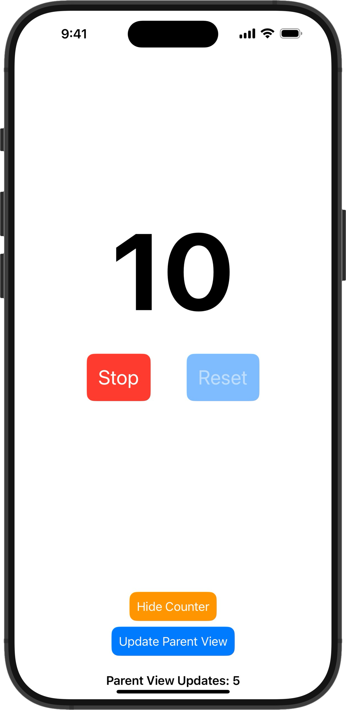

# RxSwift Counter with SwiftUI

This project provides an example of how to integrate **RxSwift** with **SwiftUI** in a more declarative and idiomatic way, using a custom property wrapper to streamline the reactive binding.

The app features a counter that starts at `0` and increments every second while running. You can start/stop the counter, and reset it to `0` when it's not running.

Additionally, the project includes a **SubscriptionsManager** to centralize subscription management, ensuring the proper lifecycle of RxSwift subscriptions. A **ParentView** is included to demonstrate that when the parent view is rerendered, the subscription continues to work as expected.

---

### Project Structure

The project consists of:
1. **`ViewModel`**: Manages the logic of the counter using RxSwift, including starting, stopping, and resetting the counter.
2. **`RxRelay` Property Wrapper**: This custom property wrapper simplifies binding a `BehaviorRelay` from RxSwift to a SwiftUI view.
3. **`SubscriptionsManager`**: A singleton that centrally manages all subscriptions, ensuring that they are properly handled even when views are rerendered or dismissed.
4. **`ContentView`**: The SwiftUI view displaying the current counter and controls for toggling and resetting.
5. **`ParentView`**: Demonstrates the behavior when the `ContentView` is shown, dismissed, or rerendered.

---

## Why Use RxSwift Instead of Swift Concurrency?

With the introduction of **Swift's `async/await`** for concurrency, one might argue that `RxSwift` is no longer needed for handling asynchronous tasks. However, this comparison overlooks important aspects of large-scale application development. 

Here’s a breakdown of the differences:

### Swift Concurrency (async/await)
Swift Concurrency provides a simple, structured way to handle asynchronous code. It’s great for straightforward use cases like waiting for data from an API or handling time-based events. However, in more complex apps with multiple services and objects interacting, the overhead grows considerably:

- **State Management**: Swift’s concurrency model doesn't simplify state management or UI binding. You still need to use traditional tools like delegates or notifications to propagate state changes between services or components.
- **Communication Overhead**: When working with multiple services, you’ll need significant boilerplate to communicate asynchronously between objects. This makes maintaining complex apps more difficult, as each component has to manage its own state, concurrency, and communication manually.

Overall, Swift Concurrency provides significant improvements in handling asynchronous code but does not entirely eliminate the need for careful state management and component communication, especially in complex scenarios.

### RxSwift's Approach
**RxSwift**, on the other hand, is inherently **reactive** and **declarative**, just like **SwiftUI**. This means that you can express state changes as data streams, allowing for clean and maintainable code where both the UI and business logic can react to changes naturally. This makes RxSwift particularly powerful for larger, more complex apps:

- **Unified State Management**: RxSwift provides a declarative, centralized way to manage state across the app. You can react to changes, propagate data across multiple services, and bind those changes directly to the UI without additional boilerplate.
- **Asynchronous Communication**: RxSwift enables seamless communication between objects using **reactive streams**, ensuring that different parts of the app can easily respond to events without needing `async/await` tasks or callbacks. This reduces the need for notifications, delegates, or manual threading logic.
- **Cross-Platform Collaboration**: RxSwift’s foundation in **ReactiveX** makes it a great tool for cross-platform collaboration, as the reactive programming concepts used in RxSwift are consistent across platforms such as **Android (RxKotlin)** or **Web (RxJS)**. This enables teams working on different platforms to collaborate using the same patterns and principles, without needing to re-learn platform-specific concurrency or communication patterns.
- **Powerful Operators**: With RxSwift, you have access to a rich set of operators (`map`, `flatMap`, `filter`, etc.) to transform, filter, and combine data streams effortlessly, making it easier to react to changes.

### Real-World Example: Complex Apps

For simple apps like this **counter**, Swift’s concurrency model might be sufficient. But in larger applications, where multiple services and objects communicate in real time, `async/await` can quickly become complex, requiring significant boilerplate for state management, communication, and error handling. 

RxSwift provides a much more **scalable solution** for complex apps. It allows you to:
- **Bind state changes to UI components** seamlessly without needing notifications, delegates, or observers.
- **Handle multiple streams of asynchronous data** and events efficiently using a unified reactive approach.
- **Collaborate across platforms** using the same reactive principles, reducing complexity for multi-platform teams.

---

## Why Use the Custom `RxRelay` Property Wrapper?

In RxSwift, updating a SwiftUI view based on a reactive data stream (like a `BehaviorRelay`) typically requires manual subscriptions and state management. Without the custom property wrapper, you would need to manage the subscription to the relay inside the view and manually update the SwiftUI state whenever the relay emits a new value.

### Without the Property Wrapper

Here’s an example of how you would bind a `BehaviorRelay` to a SwiftUI view **without** the `RxRelay` property wrapper:

```swift
import SwiftUI
import RxSwift
import RxCocoa

struct ContentViewWithoutWrapper: View {
    @State private var counter: Int = 0

    private let viewModel = ViewModel()
    private let disposeBag = DisposeBag()

    init() {
        viewModel.counterRelay
            .subscribe(onNext: { newValue in
                self.counter = newValue
            })
            .disposed(by: disposeBag)
    }

    var body: some View {
        Text("\(counter)")
            .font(.system(size: 150, weight: .bold))
    }
}
```

In this example:
- You need to manually subscribe to the `BehaviorRelay` in the `init` of the view.
- You also need to update the `@State` property (`counter`) whenever the relay emits a new value.
- Additionally, you must manage the `DisposeBag` to handle the lifecycle of the RxSwift subscription.

### With the Custom `RxRelay` Property Wrapper

By using the custom `RxRelay` property wrapper, we can avoid the manual subscription and lifecycle management in the view. The property wrapper handles it for you and binds the relay to the SwiftUI state seamlessly:

```swift
@RxRelay var counterRelay: Int

init() {
    _counterRelay = RxRelay(relay: viewModel.counterRelay, disposeBag: SubscriptionsManager.shared.disposeBag)
}
```

In this version:
- The property wrapper automatically subscribes to the `BehaviorRelay`.
- It binds the relay to SwiftUI’s `@State` under the hood, so the view updates whenever the relay emits a new value.
- You don’t have to manage the lifecycle of the subscription manually with a `DisposeBag`.

### Benefits of Using the `RxRelay` Property Wrapper

- **Less Boilerplate**: The property wrapper removes the need for manually managing the subscription to the relay and reduces the amount of code in your SwiftUI views.
- **Simplified Binding**: The relay can be directly bound to a SwiftUI view, and SwiftUI will automatically update the UI when the relay emits a new value.
- **Improved Readability**: The code is cleaner and easier to follow without needing to worry about managing RxSwift's disposal and state updates.

---

## Screenshots

<div style="display: flex; justify-content: space-around;">
    <a href="Screenshots/RxSwiftUI_CounterApp_iPhone_16_Pro_Max.png" target="_blank">
        
    </a>
    <a href="Screenshots/RxRelay.png" target="_blank">
        
    </a>
</div>

---

## How to Run the Project

1. Clone the repository.
2. Open the project in Xcode.
3. Run the app in the simulator or on a physical device.
